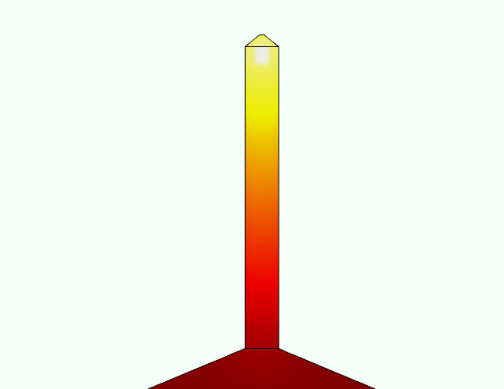
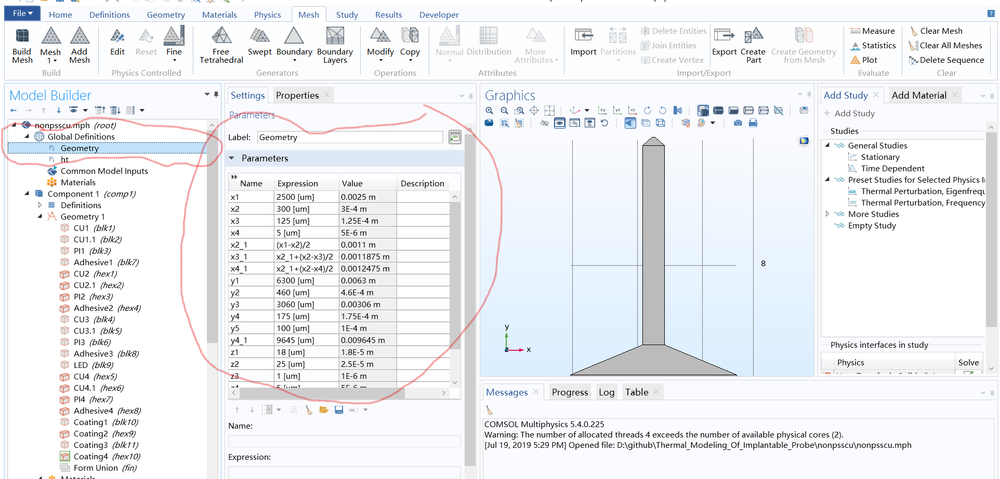
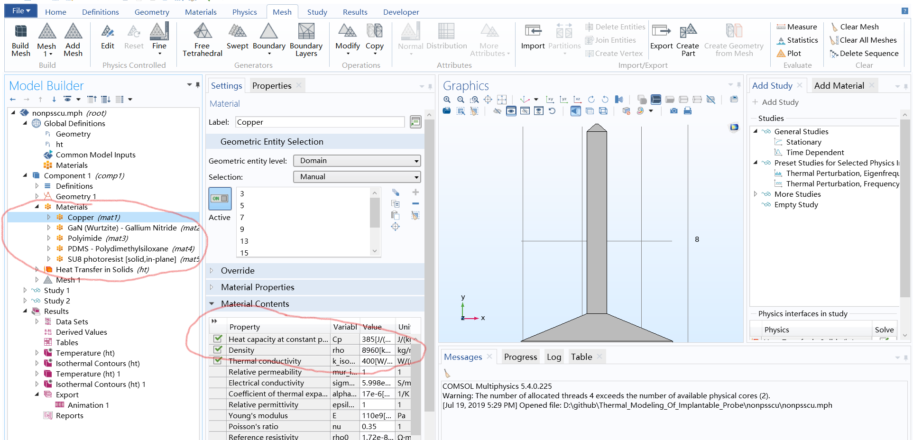

# Thermal_Modeling_Of_Implantable_Probe
Thermal Modeling of Implantable Probe for Optogenetics Using COMSOL Multiphysics.

[How to Use](#how-to-use)

[How to Modify](#how-to-modify)

[What are the Results](results)

## How to Use?

There are four folders corresponding to the two types of LEDs on top of two types of substrates, and the folders are named as **nonpsscu**, **psscu**,**nonpsspi** and **psspi**. (*Note: Up to now, only **nonpsscu** is complete, others are pending update*).

To use the simulation file, download the **.mph** file in the corresponding folder and run it with COMSOL Multiphysics, version 5.4 and above. 

### Stationary Study

If you care about the stable state, select `Stationary Study` from the left navigation bar and click study. The results will pop up once the simulation is finished. A typical result image looks like this.

### Transient Study

If you care about the transient state, select `Transient Study` from the left navigation bar and click study. Note that the convergence of transient solver may be difficult, see the Wiki of this repository for detail. A typical result image looks like this.

## How to Modify (if necessary)?

The original simulation is for the samples during our research published on [*Advanced Materials Technologies*](https://www.onlinelibrary.wiley.com/doi/abs/10.1002/admt.201700239). In future work, certain experimental parameters may will be modified and the simulation file is capable to follow the changes.  To determine whether this file can be easily modify to the new experimental setup, one rule of thumb is that the shape of the device geometry shape remains unchanged. (See the Wiki of this repository for detail.) If major changes are made in shape, please contact me to modify the model.

### Geometry

While it is required to keep the shape of the geometry, the length of edges can be freely modified (e.g. a longer probe or a smaller LED) by changing the parameters in `Global Definitions - Geometry` from the left navigation bar. See the Wiki of this repository for detail.

### Materials

In this simulation, **heat Capacity $C_p$, density $\rho$, and thermal conductivity $k$** is required. The material parameters in the current model can be seen in `Component 1 -Materials ` and the parameters can be directly changed if necessary.

### Physics

Physics of this model contains **Heat Transfer in Solid**. It is quite straightforward and there should be no need to modify. See the Wiki of this repository for detail.

## Results

Results of a specific model can be found in the **results** folder inside the main corresponding folder. Contact me or google if you want to know more about results visualization.

